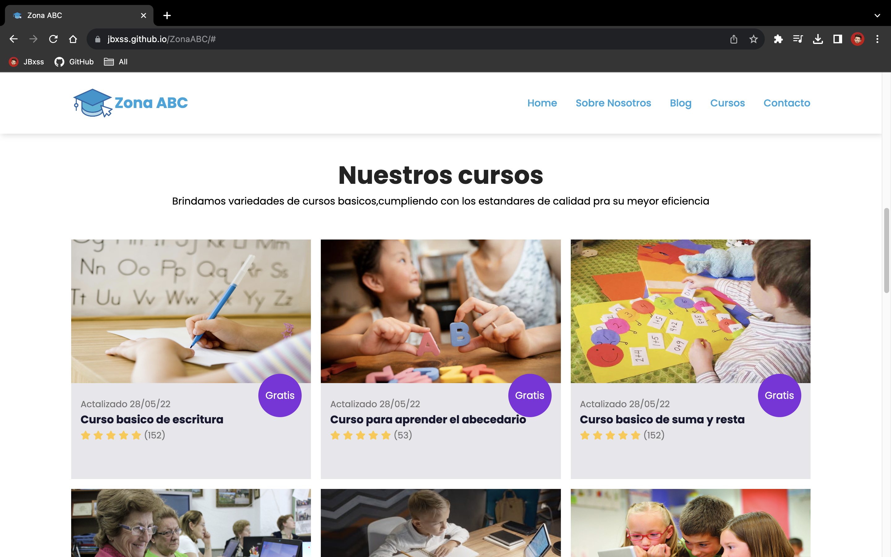
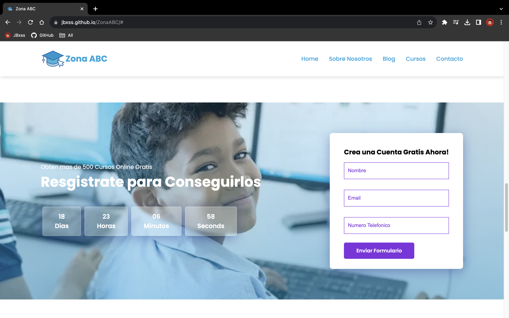
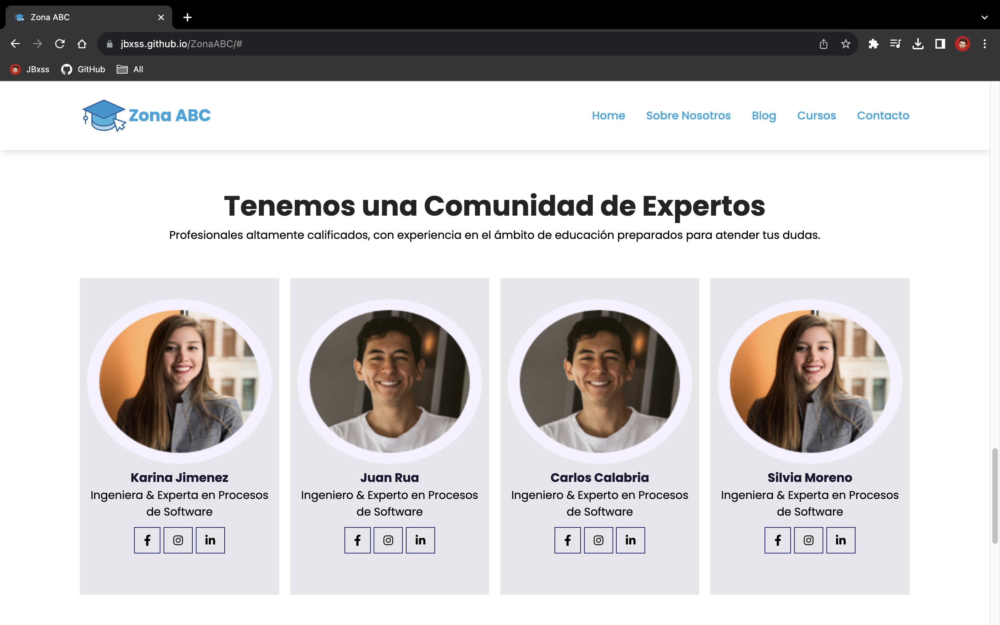

# ZonaABC - Plataforma de Cursos Online para Personas de Bajos Recursos

Bienvenido al repositorio de ZonaABC, una plataforma de cursos online diseñada para brindar oportunidades educativas a personas de bajos recursos. En este proyecto universitario surgio basado en el objetivo de desarrollo #4 acerca de la educacion, hemos creado una landing page utilizando únicamente HTML y CSS para mostrar algunos de los emocionantes cursos y talentosos profesores que estarán disponibles en la plataforma.

## Capturas de Pantalla


*Página principal*


*Página principal con la lista de Cursos*


*Página principal - Seccion de Registro*


*Página principal con la lista de Profesores*

## Características

- **Diseño Responsivo:** La landing page está diseñada para adaptarse a diferentes dispositivos, lo que garantiza una experiencia de usuario óptima tanto en computadoras de escritorio como en dispositivos móviles.

- **Selección de Cursos:** Mostramos una selección de cursos variados que abarcan diferentes temas, desde desarrollo web hasta habilidades artísticas. Los usuarios pueden explorar los cursos disponibles y obtener una descripción general de cada uno.

- **Destacados Profesores:** Presentamos a los profesores que impartirán clases en la plataforma. Proporcionamos información sobre su experiencia y conocimientos, lo que ayuda a los usuarios a tener confianza en la calidad de la enseñanza.

## Uso

1. Clona este repositorio en tu máquina local usando el siguiente comando:
   
   ```
   git clone https://github.com/JBxss/ZonaABC.git
   ```

2. Abre el archivo `index.html` en tu navegador web para acceder a la landing page y explorar los cursos y profesores.

## Enlace del Deploy

Puedes acceder a la versión desplegada de ZonaABC haciendo clic en el siguiente enlace: [ZonaABC](https://jbxss.github.io/ZonaABC/)

## Contribuciones

¡Contribuciones son bienvenidas! Si deseas mejorar la plataforma, puedes seguir estos pasos:

1. Realiza un fork de este repositorio.

2. Crea una rama para tu nueva característica o corrección.

3. Realiza tus cambios y asegúrate de que todo funcione correctamente.

4. Envía un Pull Request describiendo tus cambios. Estaremos encantados de revisarlo.

## Créditos

- Desarrollado por [Juan Bossa](https://github.com/JBxss)
- Diseño de la interfaz y concepto por [Miguel Negrete](https://github.com/M19GN)

## Licencia

Este proyecto está bajo la Licencia MIT. Puedes ver más detalles en el archivo [LICENSE](LICENSE).

---

Esperamos que este README te brinde una visión completa de ZonaABC y cómo funciona el proyecto, incluido el enlace para acceder a la versión desplegada.
